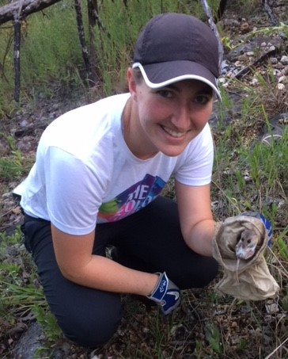

----

```{r setup, include = F, warning = F, echo = F}
library(knitr)
```

# Welcome to my webpage! 
<style>
.column-left{
  float: left;
  width: 48%;
  text-align: center;
}
.column-right{
  float: right;
  width: 48%;
  text-align: left;
}
</style>

<div class = "column-left">
```{r  out.width = "75%", echo = F}
 
```
<br>
<br>
<br>
</div>

<div class = "column-right">
I’m currently a PhD candidate at the University of Vermont. I’m interested in how ecological processes differ across spatial, temporal, and hierarchical scales. Currently, my work focuses on small mammal community assembly, host-parasite interactions, and coffee rust transmission across landscapes.  
  
Feel free to check out the Research and CV tabs for more information.
<br>
<br>
<br>
<br>
<br>
<br>
<br>
<br>
<br>
<br>
</div>  
  
  
  
## Research  

I use quantitative methods to examine how ecological processes vary across spatial, temporal, and organizational scales; especially in the context of community ecology and disease ecology. 

Over the course of my graduate studies I've also developed an interest in alternatives to p-value significance testing, and how these alternatives can be used to more effectively describe ecological systems. My past and current research primarily uses Bayesian hierarchical models, but I hope to expand to other quantitative techniques in the future. 

#### Host/ectoparasite interactions

Ectoparasites vary considerably in feeding mode and life history. This variation in turn affects how ectoparasites respond to processes operating on different scales. Using Bayesian hierarchical modeling techniques, I am investigating how an ectoparasite's life history, specifically the portion of the life cycle spent on-host, affects whether the host individual or the external environment play a bigger role in ectoparasite occupancy. 

#### Disease transmission at the landscape scale

Landscape structure influences the spread of plant pathogens, primarily by affecting pathogen dispersal. Coffee leaf rust (*Hemileia vastatrix*), a fungal disease that causes heavy economic losses in the coffee industry, is likely to be affected by landscape structure via dispersal of its wind-borne spores. My collaborators Natalia Aristizabal, Erika Bueno, Easton White, and I are using simulated landscapes to model the effects of landscape structure on coffee rust transmission.
  
## Publications  

**Beasley, E.**, Aristizabal, N., Bueno, E., & White, E. 2020. Spatially explicit models predict coffee rust spread in fragmented landscapes. bioRxiv 2020.10.16.343194. https://doi.org/10.1101/2020.10.16.343194 [pdf](BeasleyetalRustLandscape.pdf) [Github](https://github.com/Beasley015/QuestCoffeeRustLandscape)

**Beasley, E.M.** & Maher, S.P. 2019. Small mammal community composition varies among Ozark glades. *Journal of Mammalogy* 100:1774--1782. [pdf](BeasleyMaher2019.pdf) [Github](https://github.com/Beasley015/Beasley-Maher2019_Small_Mammal_Community_Ozark)
  
## CV

[Emily Beasley's CV](Beasley_CV.pdf)

## Contact

Email: ebeasley \<at\> uvm \<dot\> edu

[Github](https://github.com/beasley015)
